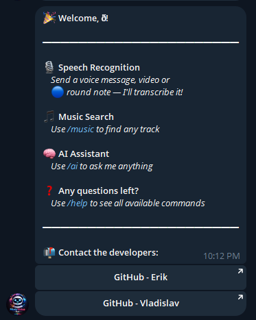

# AI Music & Voice Telegram Bot

A Telegram bot built with **aiogram + FastAPI** that provides:

- 🎙 **Voice message recognition** (Speech-to-Text)
- 😊 **Emotion analysis** for user text
- 🎵 **Music search** by:
  - Track title
  - Artist
  - Genre

The bot processes voice input, converts it to text, analyzes emotional tone, and allows users to discover music using the **Deezer Public API**.

---

## Project Overview

This project combines Telegram bot interaction, backend API processing, speech recognition, sentiment analysis, and music search functionality in one system.

Main user scenarios:
- sending a **voice message** and receiving recognized text,
- sending text for **emotion analysis**,
- searching for music by **track name**, **artist**, or **genre**,
- viewing formatted results with track details and Deezer links.

---

## Main Menu Screenshot



**Figure 1.** Telegram bot main menu demonstration.

> Add the screenshot file to `resources/main_menu_screenshot.png`.  
> If the filename is different, update the path in this README.

---

## Features

### 1. Voice Recognition
- Accepts Telegram voice messages
- Converts speech to text
- Returns recognized text to the user
- Supports Russian and English speech transcription

### 2. Emotion Analysis
- Accepts user text input
- Classifies the emotional tone of the message
- Can be used for sentiment-aware bot behavior and future NLP expansion

### 3. Music Search
Using the **Deezer Public API**, the bot can search music by:
- title,
- artist,
- genre.

The bot returns:
- track name,
- artist,
- album,
- cover image,
- Deezer track link.

### 4. Backend API Integration
The project uses **FastAPI** as a backend service to:
- process requests from the Telegram bot,
- route music search requests,
- handle voice recognition requests,
- handle emotion analysis requests,
- validate input and responses,
- centralize business logic.

---

## Used APIs

### 1. Deezer Public API
The project uses the **Deezer Public API** for music discovery and search.

**Purpose of the API:**
- search tracks by title,
- search music by artist,
- search by genre,
- retrieve track metadata such as:
  - song title,
  - artist name,
  - album title,
  - album cover,
  - direct Deezer link.

This API allows the bot to provide real-time music search results directly inside Telegram.

### 2. Groq API
The project also uses **Groq** as a ready-made AI service.

**Purpose of the API:**
- access a hosted AI model through an external API,
- process text requests,
- support intelligent bot features,
- simplify integration of LLM-based functionality without deploying a separate large model locally.

In this project, Groq is used as a **ready-to-use AI model platform** for handling AI-related functionality.

---

## AI Models

### 1. Base AI Model
**Base AI model used in the project:**  
`Groq`

**Description:**  
Groq is used in the project as a **ready-made AI model service**. It provides access to hosted large language model capabilities through API integration and is used to support intelligent processing inside the bot.

### 2. Speech Recognition Model
**Model name:**  
`d3vastated/whisper-small-ru-en-finetuned`

**Task solved by the model:**  
**Speech-to-Text (automatic speech recognition)**

**Description:**  
This is a fine-tuned Whisper-based transformer model adapted for **Russian and English speech recognition**. It processes Telegram voice messages and converts spoken audio into text. In the project, this model solves the task of **automatic speech recognition (ASR)**.

### 3. Emotion Analysis Model
**Model name:**  
`tabularisai/multilingual-sentiment-analysis`

**Task solved by the model:**  
**Text sentiment / emotion classification**

**Description:**  
This transformer model is used for **emotion and sentiment analysis of text messages**. It classifies the emotional tone of user input and enables the `/emotion` feature. In the project, the model solves the task of **text classification** for multilingual sentiment or emotion recognition.

---

## Tech Stack

- **Telegram Bot:** aiogram
- **Backend API:** FastAPI
- **Speech Recognition Model:** `d3vastated/whisper-small-ru-en-finetuned`
- **Emotion Analysis Model:** `tabularisai/multilingual-sentiment-analysis`
- **AI Platform / LLM Service:** Groq
- **Music API:** Deezer Public API
- **Language:** Python

---

## Project Structure

```text
project/
│
├── tg-bot/                # Telegram bot (aiogram)
│   ├── handlers/
│   ├── keyboards/
│   └── main.py
│
├── backend/               # FastAPI backend
│   ├── routers/
│   ├── services/
│   └── main.py
│
├── ml/                    # AI / ML models and processing logic
│
├── resources/             # Images, screenshots, and static resources
│
├── requirements.txt
├── .env
├── README.md
└── .gitignore
```

---

## Bot Commands

| Command | Description |
| :--- | :--- |
| `/start` | Start the bot |
| `/help` | Show help message |
| `/music` | Search for music |
| `/emotion` | Emotion message classification |
| `Voice message` | Convert speech to text |

---

## Team Members

- **Erik** — Telegram Bot & Deezer Integration
- **Vlad** — AI / Voice Recognition

---

## Task Distribution

### 1. Telegram Bot (aiogram)
**Assigned to:** Erik (Lead)

- Bot command handling (`/start`, `/help`, `/music`)
- Voice message handling
- Message routing
- Middleware
- Integration with FastAPI
- User session handling

**Support:** Vlad (testing & minor features)

### 2. FastAPI Backend
**Shared**

**Erik (Lead)**
- Core FastAPI setup
- API routes for bot integration
- Deezer API service integration
- Request validation
- Error handling

**Vlad (Partial)**
- Voice recognition endpoint
- AI module integration
- Logging
- Emotion analysis integration

### 3. AI / Speech Recognition Module
**Assigned to:** Vlad (Lead)

- Voice message processing
- Speech-to-text integration
- Text preprocessing
- Emotion analysis support
- Future NLP expansion

**Support:** Erik (bot-side formatting & response handling)

### 4. Deezer API Integration
**Assigned to:** Erik (Lead)

- Integration with Deezer Public API
- Searching tracks by:
  - title,
  - artist,
  - genre
- Formatting music results for Telegram
- Handling API limits and response parsing

**Support:** Vlad (optional improvements)

### 5. Testing & QA
**Shared**
- FastAPI endpoint testing
- Bot command testing
- Voice recognition accuracy tests
- Emotion analysis tests
- End-to-end testing

### 6. Deployment
**Shared**
- Environment setup
- Launch configuration
- Deployment preparation

---

## Summary Table

| Task | Erik | Vlad |
| :--- | :---: | :---: |
| Telegram Bot | Lead | Support |
| FastAPI Core | Lead | Partial |
| Voice Recognition | Support | Lead |
| Emotion Analysis | Support | Lead |
| Deezer API | Lead | Support |
| Testing | Shared | Shared |
| Deployment | Shared | Shared |

---

## Version Control

This project uses **Git** as a version control system.

The remote repository is hosted on **GitHub**, which is used for:
- source code storage,
- collaboration between team members,
- tracking changes,
- maintaining project history.

**Confirmation of version control usage:**
- ✅ Git is used for local version tracking
- ✅ GitHub is used as the remote repository

**GitHub Repository:** `https://github.com/KishlakEnjoyer/teamwork-tg-bot`

---

## Installation and Running

### 1. Clone the repository
```bash
git clone https://github.com/KishlakEnjoyer/teamwork-tg-bot.git
cd teamwork-tg-bot
```

### 2. Create and activate a virtual environment
```bash
python -m venv venv
source venv/bin/activate
```

For Windows:
```bash
venv\Scripts\activate
```

### 3. Install dependencies
```bash
pip install -r requirements.txt
```

### 4. Configure environment variables
Create a `.env` file and specify the required tokens and settings, for example:
```env
BOT_TOKEN=your_telegram_bot_token
BACKEND_URL=http://localhost:8000
GROQ_API_KEY=your_groq_api_key
```

> Do not upload the real `.env` file with secrets to GitHub.  
> Add `.env` to `.gitignore` and commit only an example file such as `.env.example`.

### 5. Run the backend
```bash
cd backend
uvicorn main:app --reload
```

### 6. Run the Telegram bot
```bash
cd tg-bot
python main.py
```

---

## Future Improvements

- Improve speech recognition accuracy
- Add richer emotion classification
- Extend NLP processing with Groq-based features
- Add search filters and recommendations
- Support multilingual voice input
- Improve result formatting and caching

---

## Conclusion

The **AI Music & Voice Telegram Bot** is a practical integration of Telegram bot development, speech recognition, sentiment analysis, hosted AI services, and music search through the Deezer API.

It demonstrates:
- Telegram bot development with **aiogram**,
- backend service design with **FastAPI**,
- speech transcription with a **Whisper-based transformer model**,
- text emotion classification with a **multilingual sentiment model**,
- AI functionality through **Groq**,
- external API usage with **Deezer**,
- collaboration through **Git** and **GitHub**.
